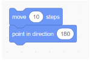
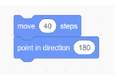
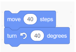
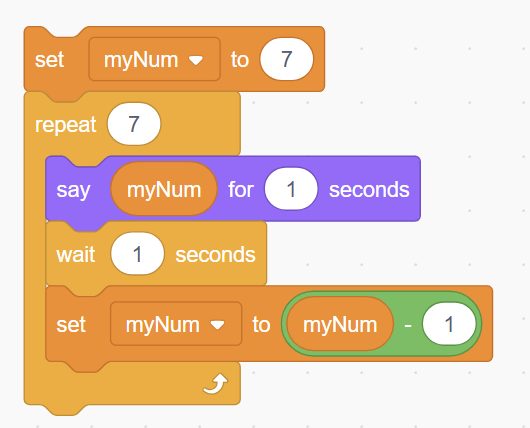
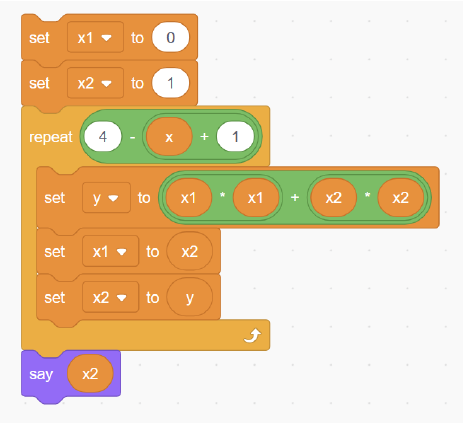
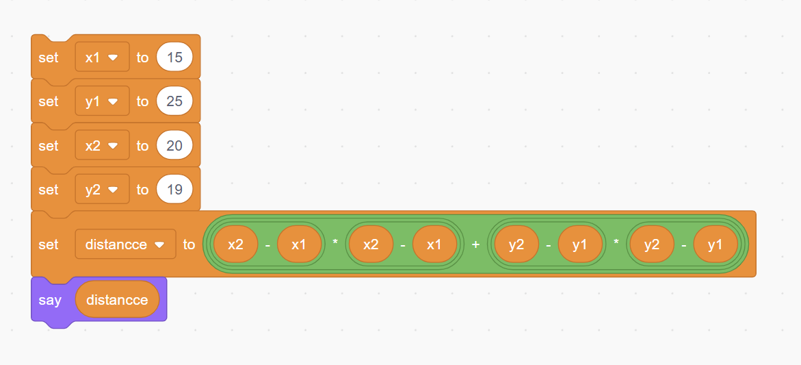
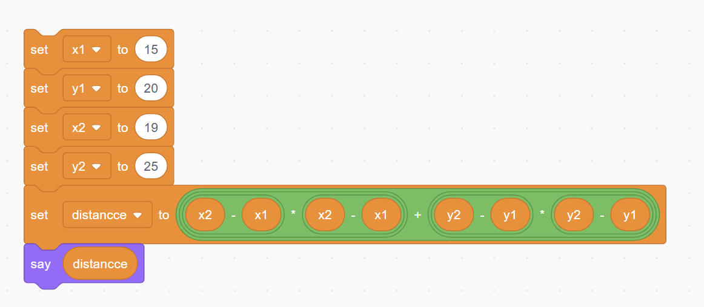
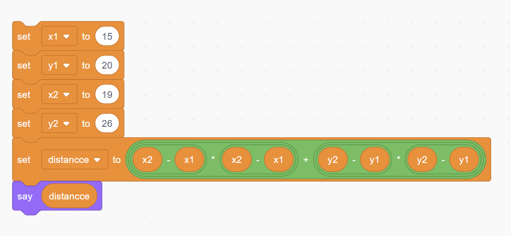
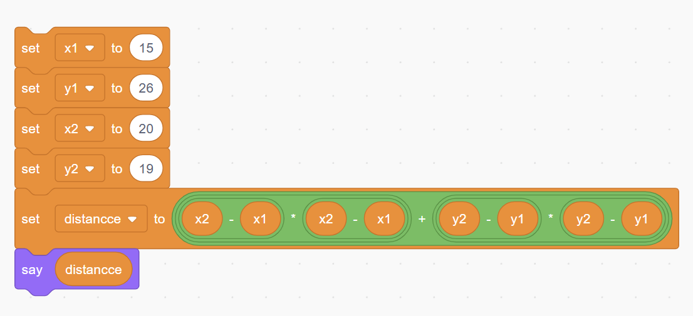
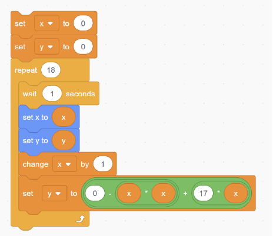

---

## **Q.1) Which blocks can be used to move the cat?**
- a) Walk  
- b) Move  
- c) Teleport  
- d) Glide  

**Answer:** b  

---

## **Q.2) Which set of blocks moves the cat 40 steps and then points down?**

- a)   
- b)   
- c)   
- d)   

**Answer:** b  

---

## **Q.3) What does the cat say here?**

  

- a) Says the number 7, for 1 second, 7 times and changes the value of the number variable by multiplying the previous value with 1.  
- b) Says the number 7, for 1 second, 7 times and changes the value of the number variable by adding the previous value with 1.  
- c) Says the number 7, for 1 second, then says numbers from 6 to 1 one by one for 1 second each.  
- d) Says the number 7, for 1 second, then says numbers from 6 to 0 one by one for 1 second each.  

**Answer:** c  

---

## **Q.4) From the previous question, what is the value of `myNum` variable after the loop ends?**

- a) 1  
- b) 2  
- c) 7  
- d) 0  

**Answer:** d  

---

## **Q.5) Let the answer for the previous question be stored in variable `x`. What does the cat say after the execution of the loop?**

  

- a) 16  
- b) 5  
- c) 29  
- d) 44  

**Answer:** b  

---

## **Q.6) Which of the following data types is primarily used for storing a sequence of characters in most programming languages?**

- a) Integer  
- b) Float  
- c) String  
- d) Boolean  

**Answer:** c  

---

## **Q.7) Which of the following statements best describes why loops are commonly used?**

- a) Loops make the code run slower but more reliably.  
- b) Loops allow you to execute a block of code repeatedly without having to write it multiple times.  
- c) Loops are only useful for error handling.  
- d) Loops automatically convert variables from one data type to another.  

**Answer:** b  

---

## **Q.8) Suppose you have an arithmetic expression involving addition, subtraction, multiplication, and exponentiation. Which statement is true about instructing a computer to evaluate it?**

- a) Such expressions cannot be computed.  
- b) A computer can only evaluate expressions involving addition and multiplication.  
- c) These expressions can be evaluated using built-in operations or libraries.  
- d) A computer can only evaluate expressions involving addition and subtraction.  

**Answer:** c  

---

## **Q.9) In which of the following code blocks is the calculation of the squared distance between two points (15, 25) and (20, 19) accomplished?**

- a)   
- b)   
- c)   
- d)   

**Answer:** a  

---

## **Q.10) What task does the block below accomplish?**

  

- a) Moves the ball in a parabolic path and stops 18 away steps from center (0, 0) in the x direction.  
- b) Moves the ball in a circular path 18 times.  
- c) Moves the ball in a parabolic path and stops 18 away steps from center (0, 0) in the y direction.  
- d) Moves the ball in a parabolic path and stops 17 away steps from center (0, 0) in the x direction.  

**Answer:** d  

---
